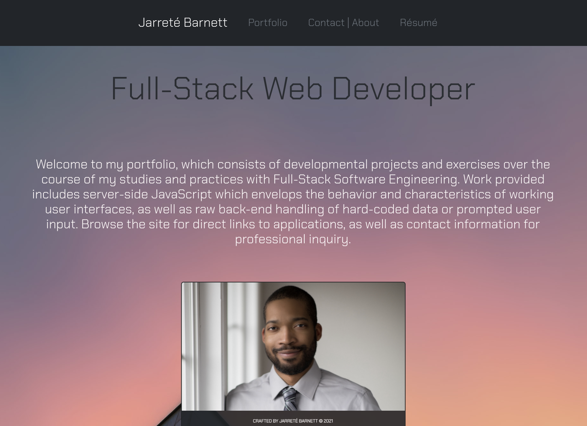
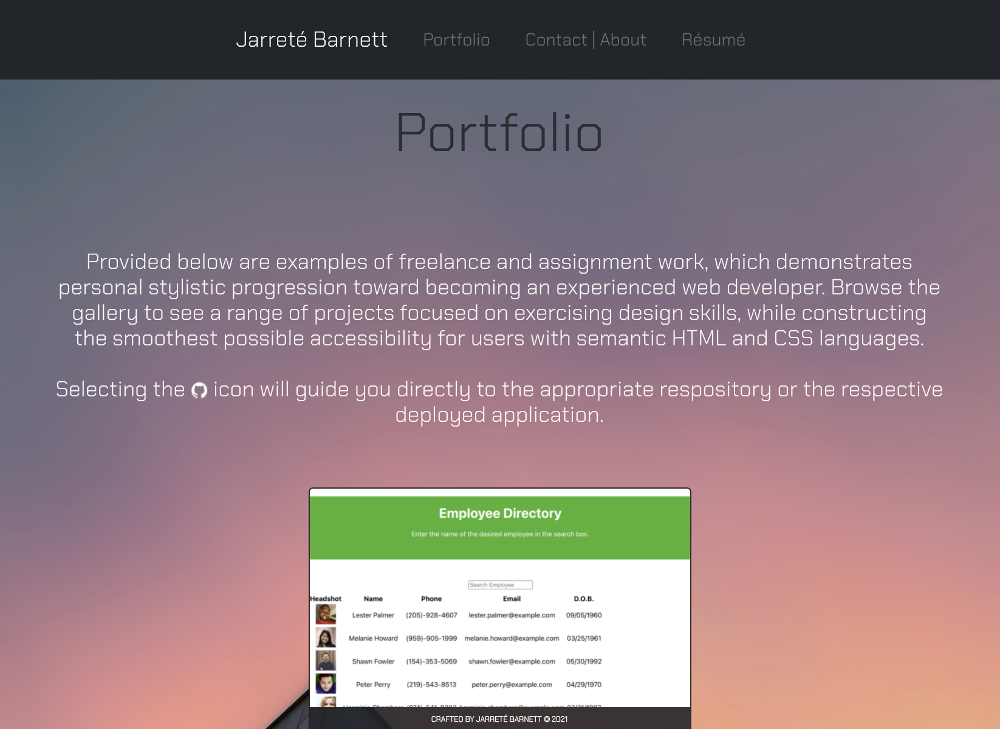
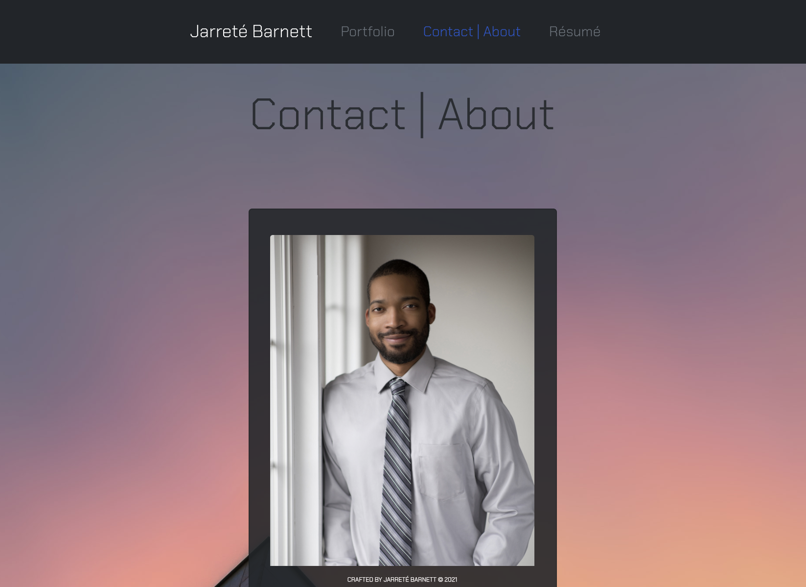

# React Portfolio

Provided in this repository is a responsive portfolio structured with React.js, which serves as a showcase of assignment work and personal projects. This will continue to grow over time as projects become more abundant. 

## Components

* Featured components on this page is a bootstrap navigation bar, which provides users easy access to material information, either about myself, or my work.

* Secondly, responsive cards are featured for a visual aesthetic, serving as representation for each distination highlighted on the pages.

* Lastly, these responsive cards are carried within the body HTML utilizing containers, rows and columns, to create a symmetrical interface for the user when navigating the page.

## Creative Decisions

While crafting the page, I settled on a neutral color scheme that is still eye catching, yet minimalistic, which provides for a concise experience for the user navigating the interface.

## User Story

```
AS A USER I want to view the subjects work history.
WHEN I click on destinations, I want to view internal links internally, and external links externaly.
SO THAT I can have a smooth navigation while surveying the subjects work.
```

## Screenshots

Provided below is a still display of the pages most recent aesthetic.







